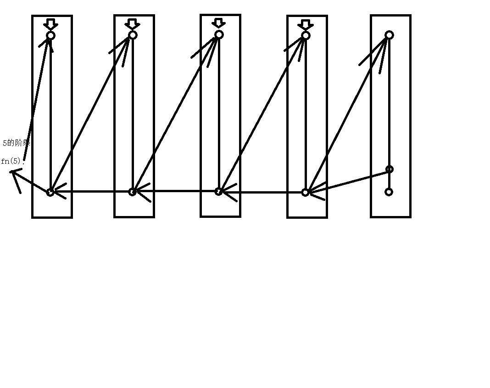

### 编程的基本规则
* 代码要具有通用性
* 整洁度
* 高内聚低耦合
---
### 函数
* 概念：函数是可以重复调用的代码块
* 特性：
  * 函数只有被调用时才会执行,或者事件驱动时会执行
  * 函数调用完毕后自动释放
* 用途：一般情况下一个小的功能就封装为一个函数代码块
* 函数的语法：
* 函数的调用方式：
---
### 函数传参
* 形参:
    * 必须符合声明变量的规则
    * 形参数量可以是任意多个
* 实参:
    * 实参可以是任意类型表达式或者值或者常量
    * 实参数量可以是任意多个
* 形参和实参必须是一一对应的，位置上有绝对的要求
* 什么时候需要传参：？
---
### arguments
* 每个函数都自带一个arguments对象
* 使用场景：参数数量不确定的时候建议使用
* 下标索引的访问方式：[0]
---
### 函数返回值
* 关键字：return
* 返回值可以任意类型的表达式或者值或者常量
* 默认的函数返回值是：undefined
* ---函数返回值是返回给调用函数的表达式
* ---调用函数就等于复制函数
* ---函数保存在内存中的代码区
* return关键字，可以结束整个函数代码块
---
### 函数的连续调用（扩展）
* 小技巧：返回函数名
---
### 匿名函数
* 语法
* 使用方式：
  * 赋值给变量
  * 自调用：不需要多处使用，一次性使用
  * 匿名函数传参
  * 匿名函数自调用的返回值返回给当前的表达式
  * 保存给变量的函数调用时才会有返回值
---
### 递归
* **递归一定要有出口**
* 自身调用自身的函数
* 
---
### 回调函数
* 通过形参调用的函数叫做回调函数
* C中的概念：通过指针调用的函数叫做回调函数
---
### 变量的作用域
* 局部变量：ES3、5中局部变量的作用域在整个函数内有效
* 全局变量：整个script标签内有效，超出script标签内的下一个script依然可以访问。
* 局部作用域：
* 全局作用域：
* 全局变量与局部变量发生名称冲突的时候，优先访问局部变量。
---
### 变量提升
* 变量会被自动提到最上面
* ES6之前的特性，ES6以后无此特性。
* ----函数也有提升
---
### 事件驱动函数执行
* document.getElementById("");
* HTML元素的内容修改
* 事件：表示发生一个动作，或者一种“行为”后产生有影响的事。
* JavaScript中事件一般配合函数使用。
* 常见的事件类型：
    * 鼠标事件
    * 键盘事件
    * HTML元素内容改变事件
    * 页面加载完成事件:window.onload
---
### 闭包
* 函数作用域外访问函数作用内变量的函数
---

