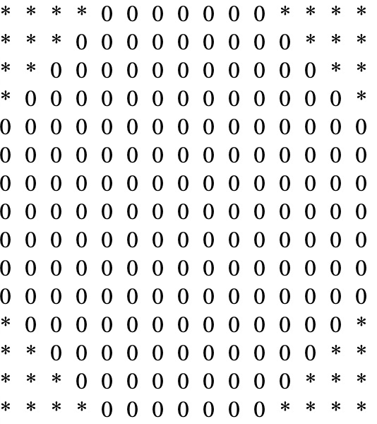

### 第二阶段月考试题
#### 二维数组求和
```javascript
var _dimensional=[
    [63,14,68,29,74,96],
    [2,40,12,37,37,87],
    [43,18,33,54,34,56],
    [26,35,66,38,31,62],
    [9,66,95,74,42,93],
    [38,37,46,10,42,22]
];
function dimensional(_dimensional){
    var _sum=0;
    //TODO:在空白处求出数组元素的总和
    
    
    
    
    
    
    
    
    return _sum;
}
document.write(dimensional(_dimensional));//===1629
```
---
#### 用星号打印一个正八边形
```javascript
function shape(){
    //TODO:在空白处填写代码
    
    
    
    
    
    
    
}
shape();
```

---
#### 表格操作
```html
<!DOCTYPE html>
<html lang="en">
<head>
    <meta charset="UTF-8">
    <title>Title</title>
    <style type="text/css">
        html,body{
            margin:0; padding:0;
            /*letter-spacing:10px;*/
            /*line-height:20px;*/
        }
        div{
            width:100%; height:30px;
        }
        div span{
            padding:5px; font-size:14px; color:#555; float:left;
        }
        table{
            width:100%;
        }
    </style>
    <script type="text/javascript">
        var _data={
            title:["ID","name","price","sold","praise"],
            list:[{
                ID:20,name:"小米",price:"1000",sold:8000,praise:899
            },{
                ID:18,name:"华为",price:"2000",sold:8999,praise:5000
            },{
                ID:30,name:"苹果",price:"5000",sold:5000,praise:5000
            },{
                ID:31,name:"vivo",price:"1500",sold:2000,praise:1500
            },{
                ID:28,name:"oppo",price:"1300",sold:1000,praise:1000
            }]
        };
        function createDataRow(_data){
            //TODO:在空白处填写代码，根据JSON数据创建表格的列表
        }
        function createTitleRow(_data){
            //TODO:在空白处填写代码，根据JSON数据创建表格的表头
            
        }
        function sort(_data,_field,_asc){//排序，参数可以自由删减
            
        }

        function events(_data){
            var _products=document.getElementById("products");
            var _container=document.getElementsByTagName("div")[0];
            _container.children[0].onclick=function(){//根据ID升序
                _products.innerHTML="";
                sort(_data,"ID",1);
                createTitleRow(_data);
                createDataRow(_data);
            };
            _container.children[1].onclick=function(){//根据价格降序
                _products.innerHTML="";
                sort(_data,"price",-1);
                createTitleRow(_data);
                createDataRow(_data);
            };
            _container.children[2].onclick=function(){//根据销量升序
                _products.innerHTML="";
                sort(_data,"sold",1);
                createTitleRow(_data);
                createDataRow(_data);
            };
            _container.children[3].onclick=function(){//根据好评升序
                _products.innerHTML="";
                sort(_data,"praise",1);
                createTitleRow(_data);
                createDataRow(_data);
            };
        }
        function main(){
            createTitleRow(_data);
            createDataRow(_data);
            events(_data);
        }
        window.onload=main;

    </script>
</head>
<body>
<div>
    <span>根据ID升序排序</span>
    <span>根据price降序排序</span>
    <span>根据sold升序排序</span>
    <span>根据praise升序排序</span>
</div>
<table id="products">

</table>
</body>
</html>
```
|ID|name|price|sold|praise|
|---|---|---|---|---|
|20|小米|1000|8000|899|
|18|华为|2000|8999|5000|
|30|苹果|5000|5000|5000|
|31|vivo|1500|2000|1500|
|28|oppo|1300|1000|1000|
---
#### 轮播图
* [淘宝](http://www.taobao.com)
